# Wiring Guide

The next paragraphs outline the connection of the Neopixel Booster. We also
provide your with step-by-step guide and assembly tips in the next chapter.

Neopixel Booster have the following pinout:

Basically, to make them work, cut your LED strips into pieces and join them via
the the booster like this:

And then connect the booster with a sufficiently thick wire (we recommend at
least 0.3 mm² for 5 meter strips, ideally choose 0.5 mm²) to distribute the
power to the modules. Be careful to not short the 5V pads of the strips on the
module. They need to be disconnected for proper module operation.

Note that you can use the square pads on the modules to power your MCU (e.g.,
Arduino or ESP32). You can also connect the data pin here.

How long should be the strips? It depends on you. There are a few factors to
consider:
- Noepixel Booster can deliver up to 4 A, thus we do not recommend to connect
  more than 60 LEDs to it in case you plan to use the full brightness.
- Most of the strips are made out of 50cm segment that you can easily desolder -
  there is no need for cutting.
- With longer segments, the voltage drop on the 5V line can become visible again.

Thus, in most of our installations, we put a booster for each 50cm segment of
the original strip.

A few tips:

- watch the arrows on the module and the strip so you don't accidentally solder
  your strips in reverse.
- bond your power wire to the strip for easy manipulation:
    - if you have a strip in silicone tubing, you can run the power wires
      through the tubing
    - otherwise, you can use a few rings of heat shrink tube to bond it.
- instead of wires, you can use [ribbon power
  cables](https://www.superbrightleds.com/moreinfo/power-wires-cables/flat-power-wire-10mm/1528/3555/)
  to make the whole assembly flat.

# Step-by-step Guide

In this guide we will walk you through the rebuild of the "IP66 60 LED/m LED
strip" - it is the LED strip with a silicone tubing. Our goal is to change its
appearance as least as possible.

First, note that the strip consists out of 50cm segments which are soldered
together.

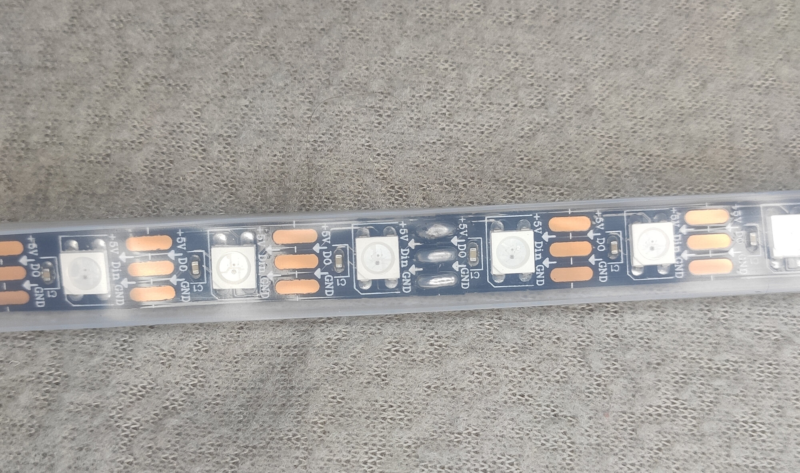

This is the place where we will cut the tubing, desolder the strips and join
them with a booster module.

Let's start with the beginning of the strip where is the power in and data
connector. It is a bunch of wires sealed by hot glue:

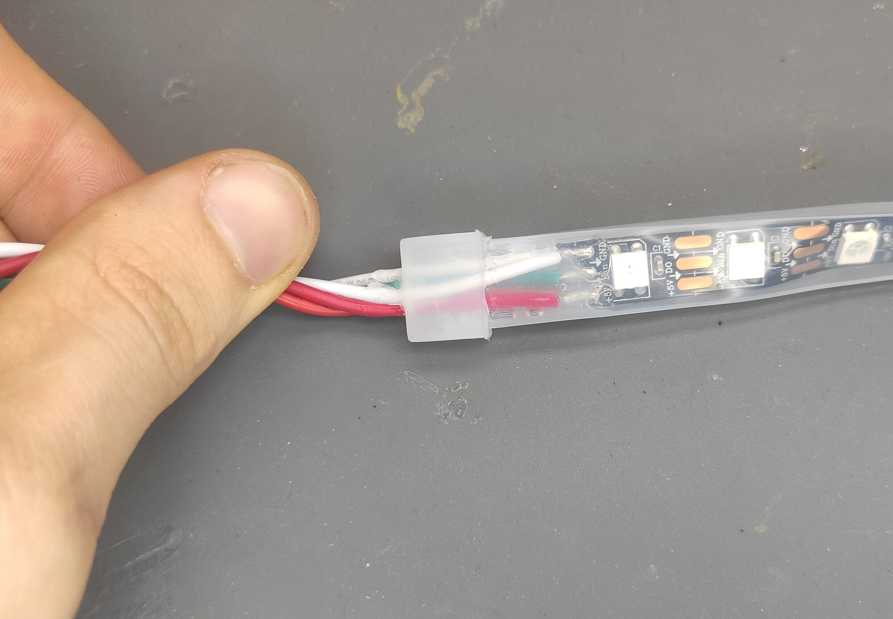

We will solder the booster like this to the strip:

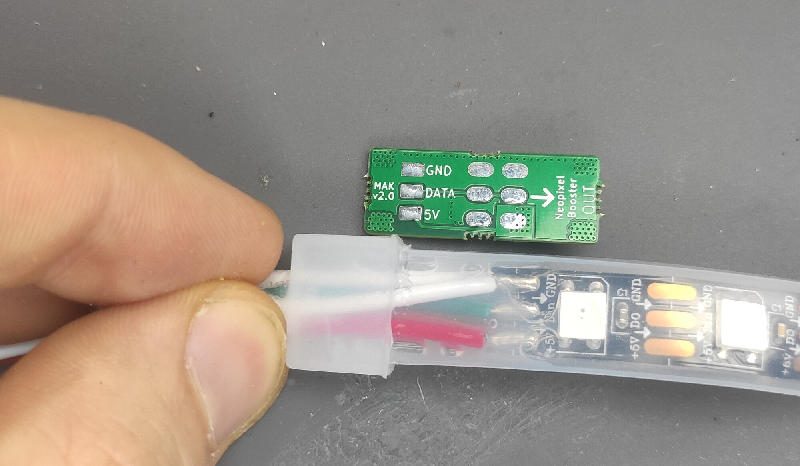

Start by carefully pulling the end cap. With enough force, the hot glue will
become loose:

Then put the silicone tubing aside:

Next, we will move to the end of the first segment. Locate the solder joint and
cut the silicone tubing:

So you expose the solder joint:

Then, take your soldering iron and desolder the segments:

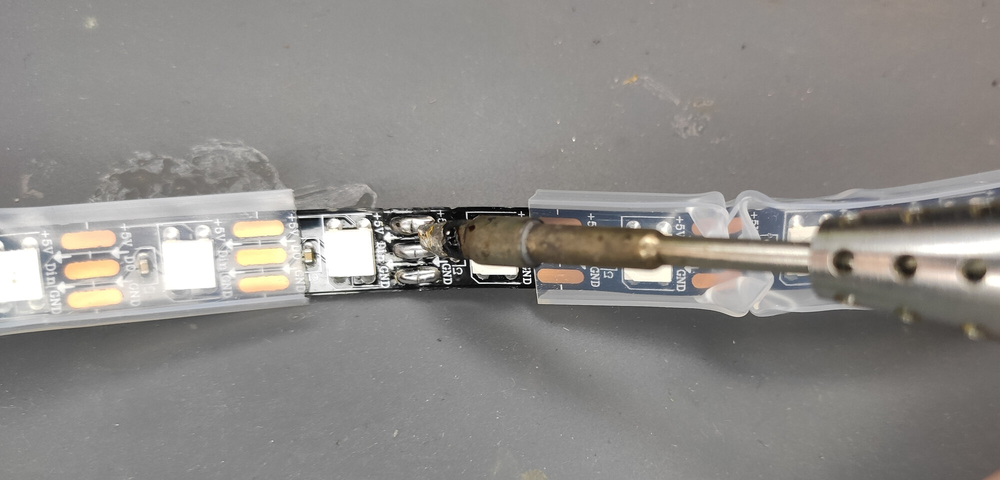

You should have a segment like this:

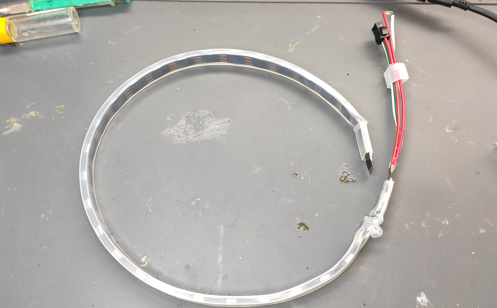

Now, desolder the original supply wires from the beginning of the connector:

Turn the strip to the back side - there will be exposed pads:

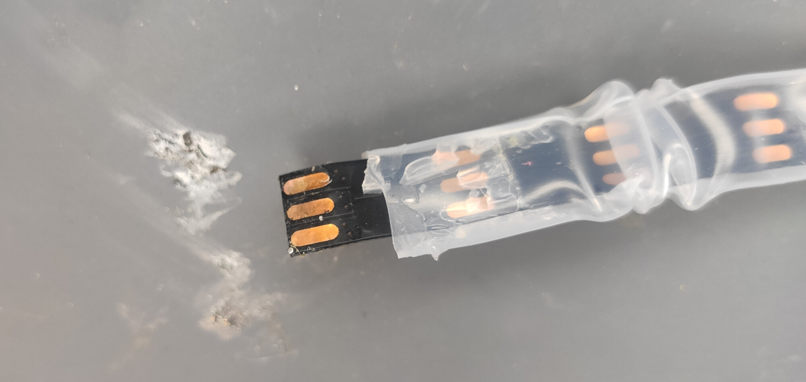

Put solder on them so they are covered in solder from both sides (this helps the heat transfer in the following soldering process):

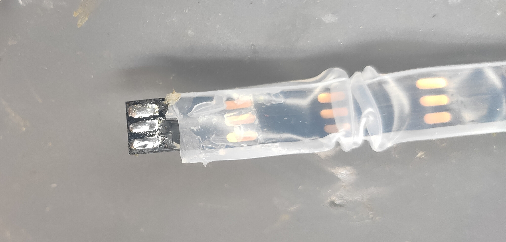

Now, solder the module to the strip. The best way to do so is to first put
solder on the pads on the module, apply a little flux on the bottom of the
strip, put it in place and heat it from above. Also, solder the original supply
wires to the square pads on the module:

The next step is to add power wire along the segment. We will put it inside the
tubing. This could look impossible at the beginning, but there are two ways
which makes the procedure easy.

The first one is to put a solid rod inside the tubing, so it can't bend. Then
you push thin wire though it. Remove the rod,  solder the think wire to the end
of the thick wire and then just pull the thin wire out:

The second method is to use 1mm thick steel wire that is long at least as the
segment. Bend a small hook on one end. Then connect use the hook to pierce the
insulation of the supply wire. And now just run the steel wire through the
tubing.

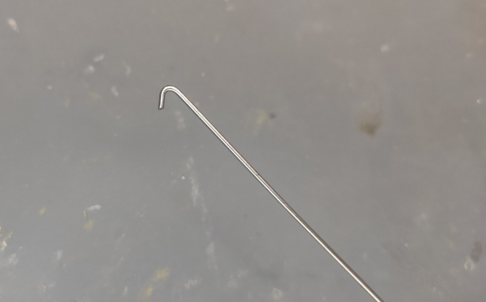

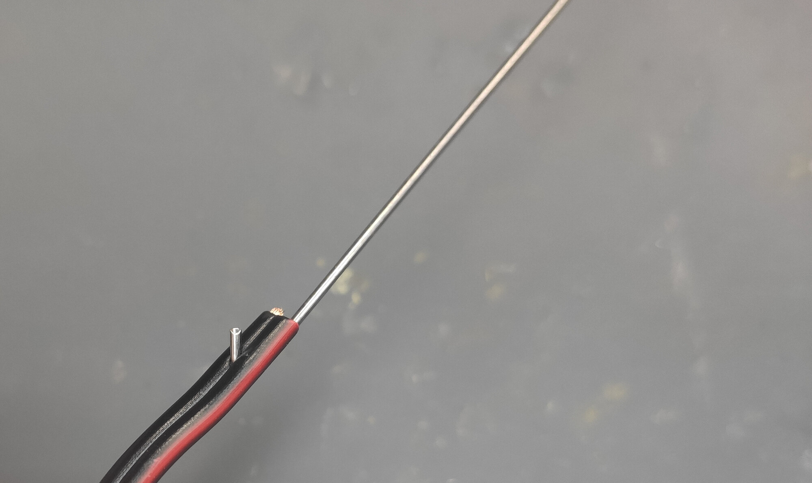

Now, solder the power wires to the modules. Be aware of the polarity.

Now, solder power wires on the other side of the modules - this will be the new
leads via which you power your strip.

Finally, you can put the cap back on. If you aim for waterproofness, use hot
glue to attach it in place.

Now put a 2cm piece of ⌀12 mm heat-shrink tube. We will use it to cover the cut
in the silicone tubing.

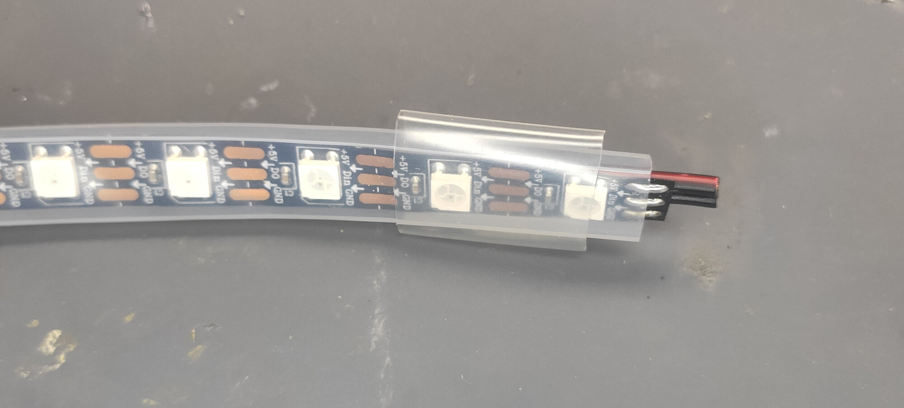

Then solder another Neopixel Booster to the end of the segment:

And also solder the power wires:

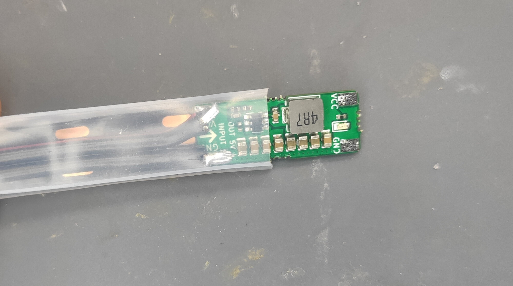

Next, solder the next segment to the module. Do not forget to run power wire thought the silicone tubing first.

Then you can slide the silicone tubing back in:

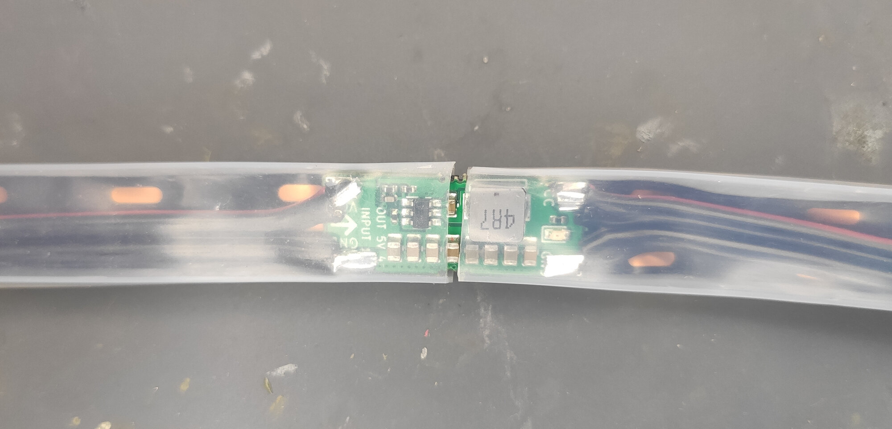

Lastly, put the heat shrink tube on the joint and seal it.

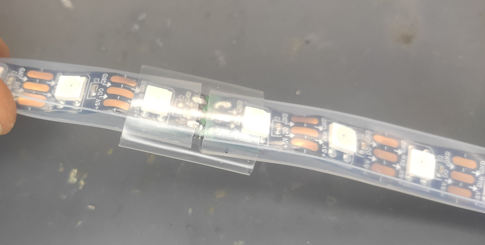

Now, just continue with rest of the segments and you are done. The whole 5m
strip took roughly an hour to upgrade completely.

[Back to the title page.](index.md)
