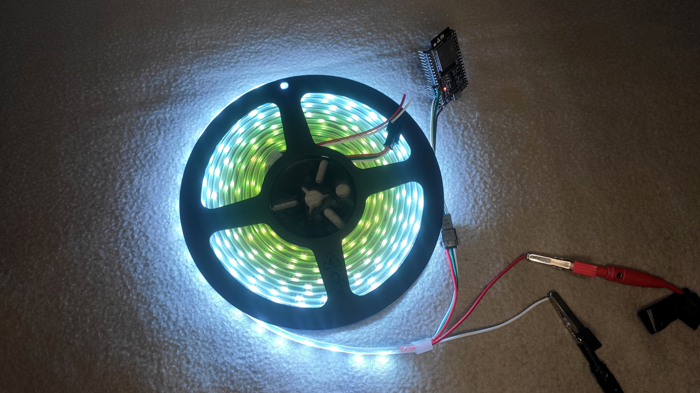
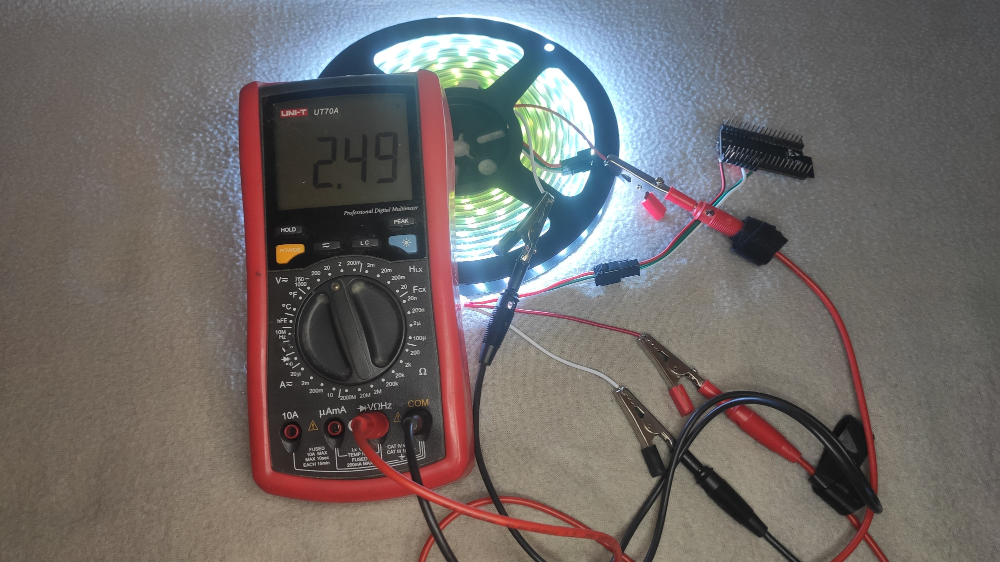
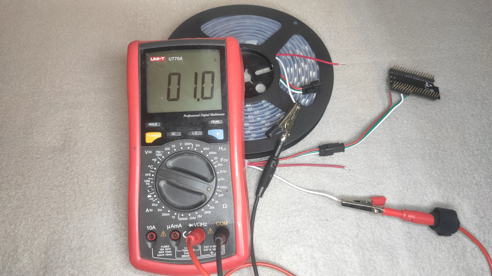
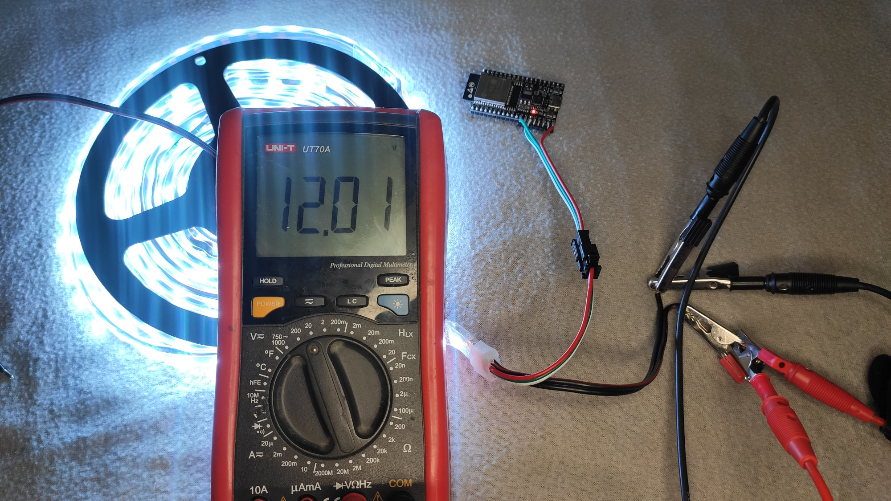
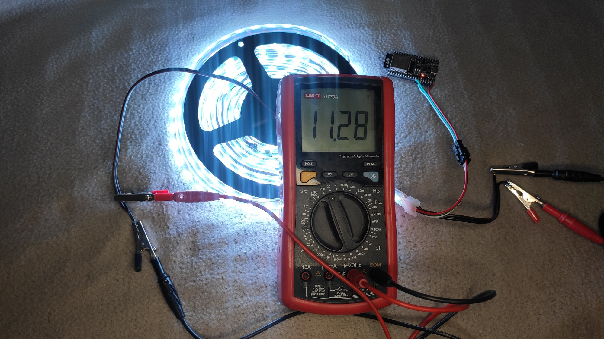

# Performance of the Modified Strips

As a benchmark, we choose the 5 m long strip with 60 LEDs per meter, which is
commonly available.

## The Problem With Common LED Strips

When you turn on all LEDs on the maximum brightens (RGB: 255, 255, 255) and
power it from a decent power supply you can observe the following:

The end of the strip is not white, but orange/red. We power the strip from 5 V:

We also measure, that the strip draws only about 3.7 A instead. The low current
is suspicious: according to datasheet, each LED should draw between 60-70 mA on
full brightness. That should be 18-21 A for our strip (300 LEDs)! Let's measure
the voltage at the end of the strip: it is only 2.5 V:

The voltage drop we observe is caused by the current flowing through the copper
traces on the flexible PCB (see [Ohm's
law](https://en.wikipedia.org/wiki/Ohm%27s_law) if you are unfamiliar with this
effect). The copper wire on the strips is relatively thin and narrow, therefore,
there is a significant voltage drop. Actually, we can try to measure the
resistance (note that this is not the ideal setup for measuring low resistance,
but it is OK for illustration purposes):

It is 1 Ohm (for the GND wire, there will one more Ohm for the +5V wire). That's
a lot for a power trace. Just make sure we measure the resistance of the traces,
not our multimeter test leads:

Therefore, we can see that the voltage drops along the strip, thus, the LEDs in
the end of the strip do not have enough voltage to shine fully. But why they
turn red? There are red, green and blue LED in the chip. Each of the LED color
have different [forward voltage drop](https://en.wikipedia.org/wiki/LED_circuit) - the blue one has the larges one and it is usually around 3 V. That means if
you LED is supplied with less than 3V, it cannot light up the blue channel and
thus, it is missing from the final color.

You could solve that with just bonding a thick wire the back of the strip.
However, a suitable wire for 21 A will be pretty thick (around 3.5 mm²).
Therefore, it is better to power the whole strip with with higher voltage, thus
lower the current flowing in the wires and only lower the voltage locally for a
few LEDs. And that's what exactly Neopixel Booster does.

If your are interested in the assembly procedure for Neopixel Boosters, visit [assembly guide](assembly.md).

## Performance of the Modified Strip

We took the strip, cut it in 50cm strips and joined them with Neopixel Boosters.
The Neopixel boosters are connected via a power supply wire with 0.5 mm². We
powered the whole setup from 12 V. It shines nicely white and the color is
uniform:

The voltage drop across the power line is roughly 0.7 V:

And the strip consumes 5.45 A:

Therefore, the modified version draws 66 W, meanwhile, the original version
draws only 17.5 W (you can tell the difference in brightness clearly). If your
are interested in knowing efficiency of such solution, see [performance
characteristics](https://roboticsbrno.github.io/RB0004-NeopixelBooster/eval_v2/index.html).

[Back to the title page.](index.md)
